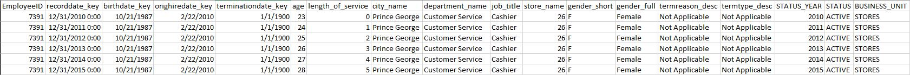
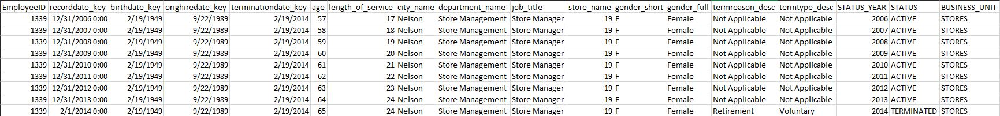
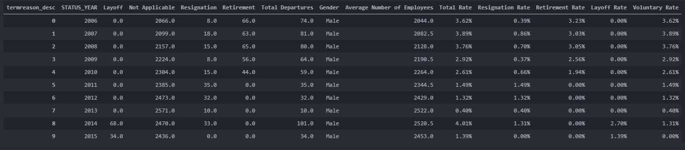

# Work Sample Challenge

### Research Question:
Using the sample data provided, are women leaving at a significantly higher or lower rate than men?  With what level of confidence?

#### Researcher Observations: 
1. The term "leaving" is poorly defined and open to interpretation.
2. The intent and audience for the analysis are missing, and left to the researcher's own discretion.

#### Medium
**Environment:**
* Python 3.8.x
* Visual Studio Code

**Packages:**
* Scipy (Chi-sqaure)
* Sklearn (Linear Regression)
* Pandas 
* Numpy
* Os
* Plotly (Visualization)
* Dash (Interaction)

### Data Cleaning
Example Employee #1

Example Employee #2

Date Values and NaT.\
Similarities between CAVE and TO data.

### Rate Calculations
**Attrition Formula:** \
Departures - Average Number of Employees (n) * 100

**Total vs. Year / Year**

**Average Number of Employees (n) Formula:** \
(Employees at start of period (n0) + Employee at end of period (n1)) / 2 \
*n = (n0 + n1)/2*
- n1 logic ---> STATUS = 'ACTIVE' for i in 'STATUS_YEAR'
- n0 logic ---> STATUS = 'ACTIVE' for i in 'STUTUS_YEAR' -1
- n0 logic for 2006:
~~~python
df[(df['STATUS_YEAR'] == 2006) & (df['orighiredate_key'] <= '2005-12-31') & (df['gender_full'] == 'Male')].nunique()
~~~

#### Python Code Snippet
~~~python
males_df = df.loc[df['gender_full'] == 'Male']
males_df = males_df.groupby(by=['STATUS_YEAR', 'termreason_desc'])['EmployeeID'].nunique()
males_df = males_df.unstack('termreason_desc')
males_df = males_df.fillna(0)
males_df.rename(columns = {'Resignaton':'Resignation'}, inplace = True)
males_df['Total Departures'] = males_df['Layoff'] + males_df['Resignation'] + males_df['Retirement']
males_df['Gender'] = 'Male'
males_df = males_df.reset_index()

# n0 code for years other than 2006
a_m = (males_df['Not Applicable'].rolling(min_periods=1, window=2).sum())/2
males_df.loc[males_df['STATUS_YEAR'] != 2006, 'Average Number of Employees'] = a_m

# n0 code for 2006
b_m = df[(df['STATUS_YEAR'] == 2006) & (df['orighiredate_key'] <= '2005-12-31') & (df['gender_full'] == 'Male')].nunique()
c_m = males_df.at[0,'Not Applicable']
d_m = (b_m['EmployeeID'] + c_m) / 2

males_df.loc[males_df['STATUS_YEAR'] == 2006, 'Average Number of Employees'] = d_m

# Rate calculations
males_df['Total Rate'] = (males_df['Total Departures'] / males_df['Average Number of Employees']).map('{:.2%}'.format)
males_df['Resignation Rate'] = (males_df['Resignation'] / males_df['Average Number of Employees']).map('{:.2%}'.format)
males_df['Retirement Rate'] = (males_df['Retirement'] / males_df['Average Number of Employees']).map('{:.2%}'.format)
males_df['Layoff Rate'] = (males_df['Layoff'] / males_df['Average Number of Employees']).map('{:.2%}'.format)
males_df['Voluntary Rate'] = ((males_df['Resignation'] + males_df['Retirement']) / males_df['Average Number of Employees']).map('{:.2%}'.format)
~~~

### Output:

### Confidence Level
I was asked to compare two groups with a dichotomous dependent variable - males and females and a boolean value.

**Enter:** Scipy

I chose a 2x2 Contingency Chi-square (X2).

* H0: Gender and Attrition are independent.
* H1: Gender and Attrition are not independent.

##### Chi-square (X2) Results and interpretation
The p value obtained from the chi-square test for independence is significant (p < 0.05), and therefore, we can conclude that there is a significant association between gender (male and female) with attrition outcome (attrition and non-attrition)

### Overall Findings
I developed a Web Application (written in Python and Dash) to summarize my findings.